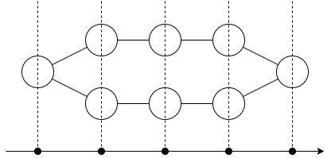

# R - ランダムウォーク

- 問題: [atcoder/fps-24/fps_24_r](https://atcoder.jp/contests/fps-24/tasks/fps_24_r)
- 問題名: R - ランダムウォーク
- difficulty: `5`
- tags: `パス上のwalk` `walkの母関数` `巡回畳み込み`
- id: `atcoder/fps-24/fps_24_r`
- logged_at: `2026-07-02`

## memo

$n=2^N$ とします．

端での遷移確率が違うようにも見えますが，次の絵を見ると解決です．「円環上をランダムウォークして， $x$ 座標だけを観測する」という問題だと思うことができます．

結局， $(x+x^{-1})^{T}\pmod{1-x^{2n}}$ が求まれば ok です．

これは繰り返し二乗法で求めると $O(n\log n\log T)$ といった計算量になりそうですが，今回は $n=2^N$ の制約からもっと簡単です．

FFT は巡回畳み込みの関係を各点積に変えるのでしたから，今回のような巡回畳み込みに関する $T$ 乗計算は，周期 $2^{N+1}$ の FFT をしたあと，各点で $T$ 乗をとり，IFFT で戻せばよいです．

知名度は多項式乗算よりも低いですが，むしろ通常は多項式乗算を，FFT と巡回畳み込みの関係を使って導出するという形で理解するはずなので，多項式乗算と FFT の関係を理解していればこれも理解できると思います．
